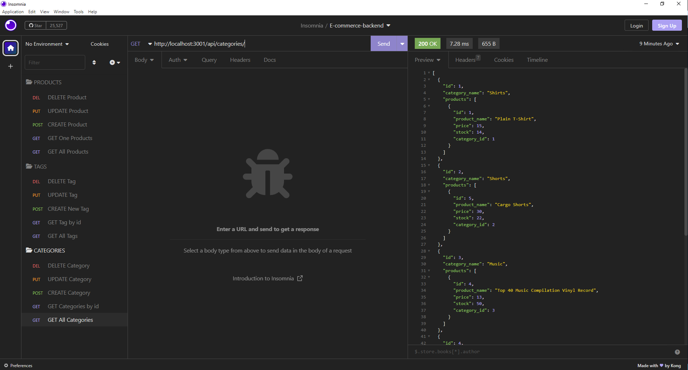

# E-Commerce-Back-End

## Description

This application is meant to simulate an actual business website's backend process by creating, storing and manipulating product data.

## Usage

Use following commands to run the application:
"npm run seed" and "npm run start"

Screenshot:
 
Walkthrough Video:
[https://drive.google.com/file/d/1Gxqeh-kpuZ8Y1GnsKWBJ0Hqf1RHM7jOM/view?usp=share_link](https://drive.google.com/file/d/1Gxqeh-kpuZ8Y1GnsKWBJ0Hqf1RHM7jOM/view?usp=share_link)

## Credits

Contributors: Leon Forsythe, Eric Kim, Anthony Cedrone and Justin Pauldo

## License
This project is licensed under the MIT license. https://choosealicense.com/licenses/mit/
